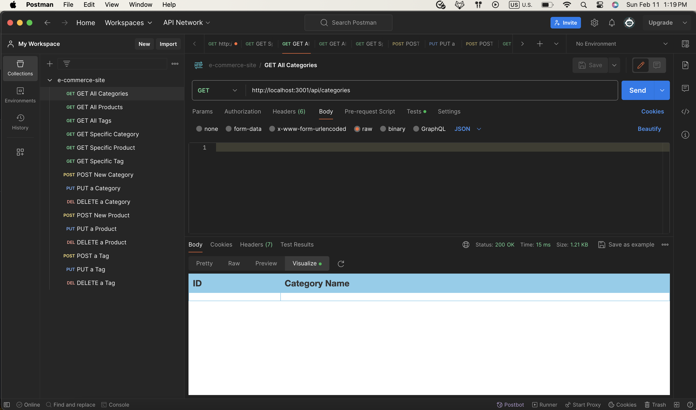
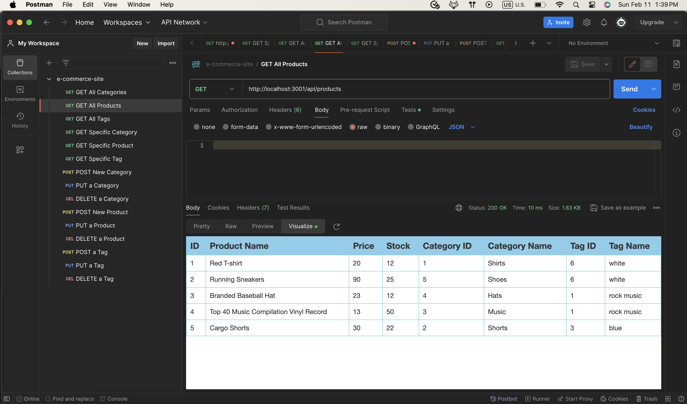
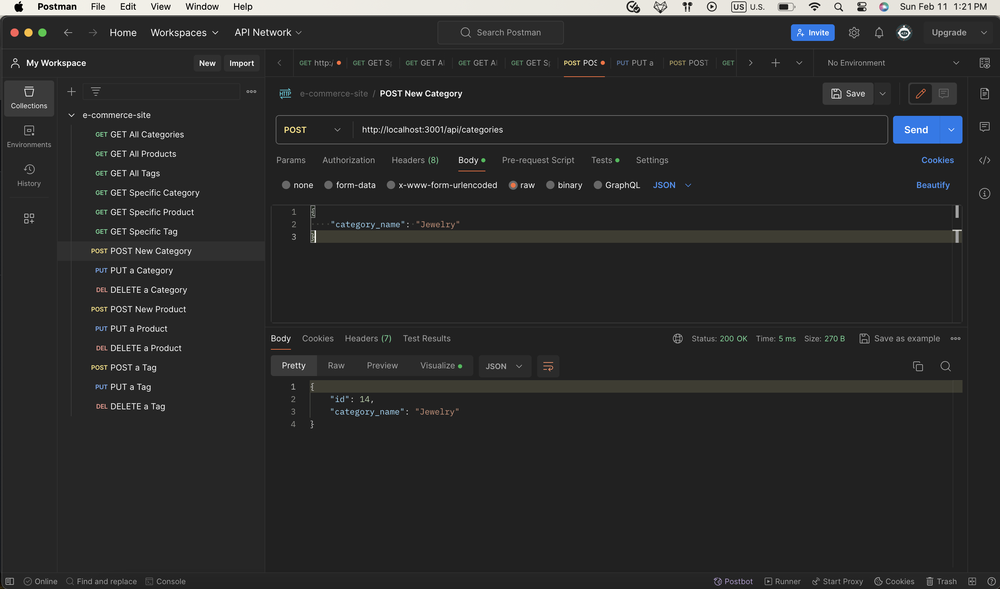
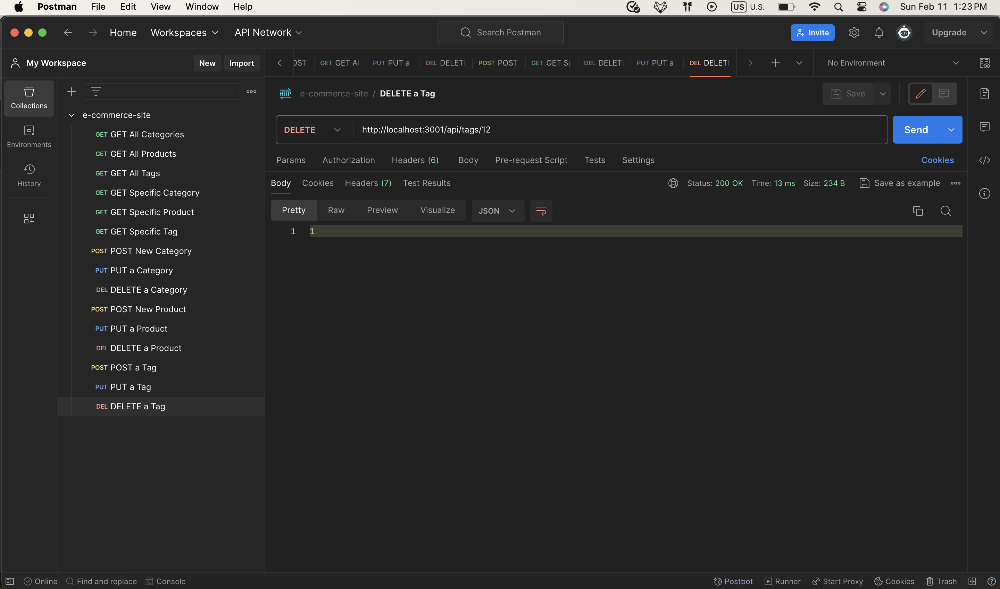

# ORM-BACKEND

## License

[](https://opensource.org/licenses/MIT)

## User Story
```md
AS A manager at an internet retail company
I WANT a back end for my e-commerce website that uses the latest technologies
SO THAT my company can compete with other e-commerce companies
```

## Description:
The application prompts the user to select a color and shape, providing text for the logo, and saves the generated SVG to a `logo.svg` file which contains the results of the users input. 

## Table of Contents:

- [License](#License)
- [User Story](#User-Story)
- [Description](#Description)
- [Acceptance Criteria](#Acceptance-Criteria)
- [Screenshots](#Screenshots)
- [Demonstration](#Demonstration)
- [Installation](#Installation)
- [Running Application](#running-application)
- [Author](#Author)
- [Acknowledgments](#Acknowledgments)


## Acceptance Criteria
```md
GIVEN a functional Express.js API
WHEN I add my database name, MySQL username, and MySQL password to an environment variable file
THEN I am able to connect to a database using Sequelize
WHEN I enter schema and seed commands
THEN a development database is created and is seeded with test data
WHEN I enter the command to invoke the application
THEN my server is started and the Sequelize models are synced to the MySQL database
WHEN I open API GET routes in Insomnia for categories, products, or tags
THEN the data for each of these routes is displayed in a formatted JSON
WHEN I test API POST, PUT, and DELETE routes in Insomnia
THEN I am able to successfully create, update, and delete data in my database
```

## Screenshots:

### Displaying All Categories

### Displaying All Products 

### Posting New Category

### Deleting Tag_Name 



## Demonstration: 


## Installation:
```md
1. Open the cloned repository in any source code editor e.g. Visual Studio Code.
2. Open integrated terminal on DB Folder within VS Code.
3. 'npm i' to install the packages needed.
```

## Running Application
```md
1. Log in to your mySQL shell
2. Run the schema by using command `source ./db/schema;` in your terminal.
3. Navigate to new terminal using `exit` in MYSQL. 
4. Populate database by running seed files with command, `npm run seed`.
5. Start the server with command `node server.js`
6. Use Postman or a similar technology to Get, Post, Put, and Delete different Categories, Products, and Tags.
```

## Author

Follow me on Github at [Utero93](https://github.com/Utero93) Additional questions or concerns? feel free to contact me at angel.m.gonzalez193@gmail.com. 
